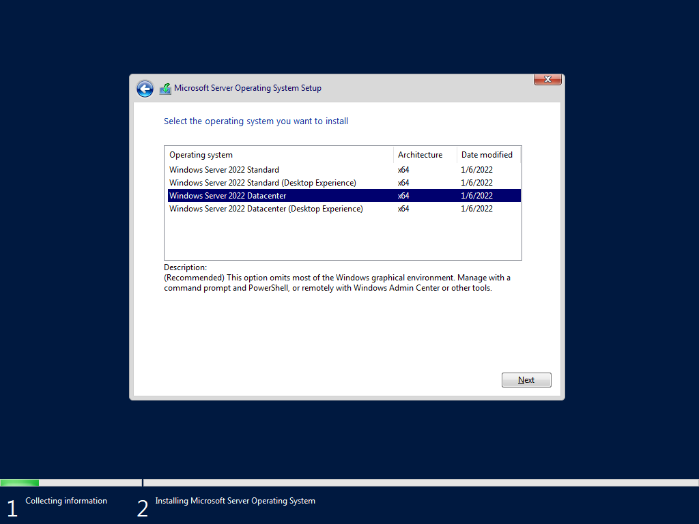

# Windows Containers on MiniKube

Currently, Windows containers are not supported on MiniKube. This repo describes the steps for a prototype of running Windows containers on MiniKube.


> Important: This is not a supported project by MiniKube. If the maintainers of MiniKube decide to support Windows containers, there's additional development work needed.

## What this project does
The goal of this project is to implement a Windows node to a MiniKube cluster, with the intent to try out Windows containers. What the steps in this projec will do, is to use the existing Kubernetes mechanism to add a Windows node to your MiniKube cluster, configure the Flannel CNI so the Windows and Linux can co-exist and comminicate with each other, to then allow you to deploy Windows containers to the Windows nodes. After completion, your MiniKube API won't be aware of the new Windows node, but the underlying Kubernetes infrastructure will. As a result, you can use kubectl, but not the minikube cli.


## Requirements
To get started you'll need:
- Windows 11 or 10 host with Hyper-V installed
- An External Switch must be configured
- MiniKube for Windows must be installed
- An Evaluation install media (ISO file) for Windows Server 2022

### Creating and configuring a new MiniKube cluster

Open a new elavated PowerShell session. Let's start by creating a new MiniKube cluster:

```powershell
$SwitchName = Read-Host -Prompt "Please provide the name of the External Virtual Switch to be used"
minikube start --driver=hyperv --hyperv-virtual-switch=$SwitchName --nodes=2 --cni=flannel --container-runtime=containerd
```

> Important: The above will deploy a 2 node cluster. You can change to a single node by removing '--nodes=2'. If deploy a single node, the command below needs to be run on just that node.

Next, we need to prepare the Linux nodes for Windows-specicif Flannel CNI configuration:

```powershell
minikube ssh
sudo sysctl net.bridge.bridge-nf-call-iptables=1
exit
minikube ssh -n minikube-m02
sudo sysctl net.bridge.bridge-nf-call-iptables=1
exit
```
Next, we will update the Flannel CNI for Windows. For this project, I have configured the kube-flannel.yml file with the appropriate settings:

```powershell
wget -Uri https://raw.githubusercontent.com/vrapolinario/MinikubeWindowsContainers/main/kube-flannel.yml -OutFile .\kube-flannel.yml
kubectl apply -f kube-flannel.yml
```

Now we need to make sure the flannel deamon set is restarted to reflect the new Windows-specific configuration.

```powershell
kubectl get ds -A
kubectl rollout restart ds kube-flannel-ds-amd64 -n kube-system
kubectl get pods -A
```

Make sure the pod has terminated and the new one is running. All pods should show a running state at this point.

### Creating a Windows node manually
For Linux nodes, you don't need to manually deploy the VM and OS, because MiniKube takes care of creating a new VM, downloading the OS image, and deploying the image to the VM. For Windows this is not supported, so we will perform these steps manually.

Let's start by creating a new VM:

```powershell
$VMName = 'minikube-m03'
$SwitchName = Read-Host -Prompt "Please provide the name of the External Virtual Switch to be used (This should be the same Switch as the MiniKube VMs"
$ISOFile = Read-Host -Prompt "Please provide the full path for the Windows Server 2022 install media (ISO file)"
New-VM -Name $VMName -Generation 1 -MemoryStartupBytes 6000MB -Path ${env:homepath}\.minikube\machines\ -NewVHDPath ${env:homepath}\.minikube\machines\$VMName\VHD.vhdx -NewVHDSizeBytes 127000MB -SwitchName $SwitchName
Set-VM -Name $VMName -ProcessorCount 2 -AutomaticCheckpointsEnabled $false
Set-VMProcessor -VMName $VMName -ExposeVirtualizationExtensions $true
Set-VMDvdDrive -VMName $VMName -Path $ISOFile
Start-VM -Name $VMName
```

You will need to install Windows Server 2022 on the VM. Follow the installation wizard to Install a Server Core instance:


After the installation is complete, you need to set up a new local admin password:


Once you're logged in, type 15 to exit the SCOnfig screen.

### Configuring the Windows node for MiniKube

> Important: The commands in this section need to be run inside the Windows node.

With the VM created and OS installed, we can now move to configuring the Windows node for MiniKube. Let's start by changing the instance name and installing the Continers feature:

```powershell
Rename-Computer -NewName minikube-m03
Install-WindowsFeature -Name containers
Restart-Computer -Force
```

> Important: You can use a different name for this Windows instance. I'm keeping "minikube-m03" for consistency with the other nodes.

